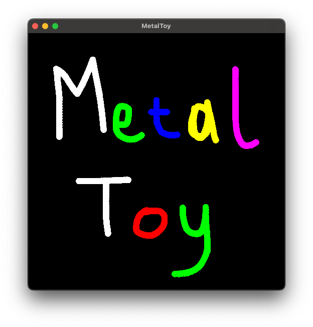

# MetalToy
A shader toy for the Metal API.

<div align="center">
  
</div>

## Build Instructions
### Prerequisites

Before you start, install **CMake**
### Build 
```bash
git clone https://github.com/Qirias/MetalToy
cd MetalToy
```
### Xcode
```bash
chmod +x xcode.sh
./xcode.sh
open build_xcode/MetalToy.xcodeproj
```

### Standalone
```bash
chmod +x standalone.sh
./standalone.sh
```
